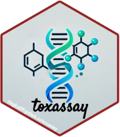
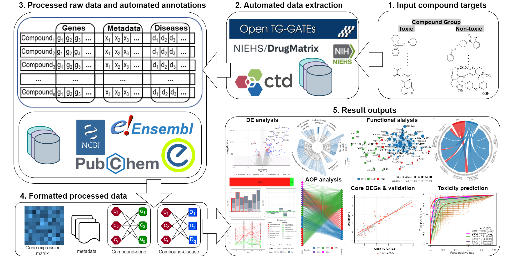
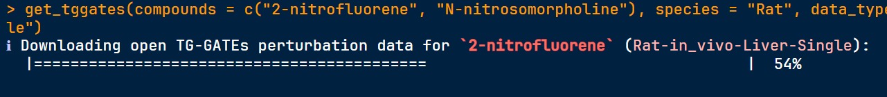

<!-- README.md is generated from README.Rmd. Please edit that file -->

```{r, include = FALSE}
knitr::opts_chunk$set(
  collapse = TRUE,
  comment = "#>",
  fig.path = "man/figures/README-",
  out.width = "100%"
)
options(tibble.print_min = 5, tibble.print_max = 5)
```

# toxassay <a href="https://dplyr.tidyverse.org"></a>

<!-- badges: start -->
[](https://cran.r-project.org/package=dplyr)
[](https://github.com/tidyverse/dplyr/actions/workflows/R-CMD-check.yaml)
[](https://app.codecov.io/gh/tidyverse/dplyr?branch=main)
<!-- badges: end -->

## Overview

ToxAssay is an R-based software package designed for the comprehensive evaluation of drug-induced toxicity utilizing complex toxicogenomics databases. The package offers a comprehensive suite of functions, encompassing: 

* Automated acquisition, preprocessing, and annotation of data by compound name for efficient management.
* Identification of molecular markers for targeted toxicity, such as differentially expressed genes (DEGs),adverse outcome pathways (AOPs), functional pathways, and Protein-Protein Interaction (PPI) networks,  etc.
* Development of optimized machine-learning classifiers for predicting the targeted toxicity in test samples of compounds.

Workflow of ToxAssay in five main steps:


## Installation

```{r, eval = FALSE}
# Install released version from CRAN
install.packages("toxassay")
```

To get a bug fix or to use a feature from the development version, you can install 
the development version of toxassay from GitHub.

```{r, eval = FALSE}
# install.packages("pak")
pak::pak("FanLiuLab/toxassay")
```

## Usages

### Download and preprocess analysis-ready data

In the current version of **ToxAssay**, users can download and process raw compound perturbation data from the [Open TG-GATEs](https://dbarchive.biosciencedbc.jp/en/open-tggates/download.html) and [DrugMatrix](https://ntp.niehs.nih.gov/data/drugmatrix) databases, as well as curated relational data from the [CTD](https://ctdbase.org).

Available compounds in databases:
```{r, eval = FALSE}
# Compounds in Open TG-GATEs database
# Data available for compounds in Rat in-vivo liver Single data
tggates_compounds(species = "Rat", data_type = "in_vivo", tissue = "Liver", dose_type = "Single")

# Compounds in Open DrugMatrix database
# Data available for compounds in `Liver`
drugmatrix_compounds(tissue = "Liver")
```

Automatically download and process data by compound name from the databases: 
```{r, eval=FALSE}
# Get data from Open TG-GATEs
get_tggates(compounds = c("2-nitrofluorene", "N-nitrosomorpholine"), species = "Rat", data_type = "in_vivo", tissue = "Liver", dose_type = "Single")

# Get data from Open DrugMatrix
get_drugmatrix(compounds = c("Ethanol", "Estriol"), tissue = "Liver")

# Get data from CTD
get_ctd(compounds = c("Ethanol", "Estriol"), gene_parm = "cgixns", disease_parm = "diseases")
```


### Differential expression analysis
```{r}
library(toxassay)
set.seed(100)
sim_data <- simulate_tgxdata(n_de = 10, n_ee = 100, n_com = c(5,5), d=1)
com_group <- list(non_toxic = paste0("Compound", 1:5), toxic = paste0("Compound", 6:10))
tgx_degs(com_group, 
         ge_matrix = sim_data$expression, 
         metadata = sim_data$metadata, 
         gr_diff = TRUE, log10p = TRUE)
```


## Getting help

If you encounter a clear bug, please file an issue with a minimal reproducible example on [GitHub](https://github.com/ringku09/toxassay/issues). For questions and other discussion, please send an [E-mail](mailto:ringku_740@yahoo.com).
