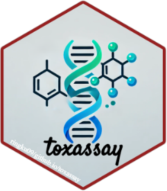

<!-- README.md is generated from README.Rmd. Please edit that file -->

# toxassay <a href="https://dplyr.tidyverse.org"></a>

<!-- badges: start -->

[](https://cran.r-project.org/package=dplyr)
[](https://github.com/tidyverse/dplyr/actions/workflows/R-CMD-check.yaml)
[](https://app.codecov.io/gh/tidyverse/dplyr?branch=main)
<!-- badges: end -->

## Overview

ToxAssay is an R-based software package designed for the comprehensive
evaluation of drug-induced toxicity utilizing complex toxicogenomics
databases. The package offers a comprehensive suite of functions,
encompassing:

- 1)  automated acquisition, preprocessing, and annotation of data by
      compound name for efficient management.
- 2)  identification of molecular markers for targeted toxicity,
      including DEGs, AOPs, functional pathways, and Protein-Protein
      Interaction (PPI) networks.
- 3)  development of optimized machine-learning classifiers for
      predicting the targeted toxicity in test samples of compounds.

dplyr is a grammar of data manipulation, providing a consistent set of
verbs that help you solve the most common data manipulation challenges:

- `get_tggates()` adds new variables that are functions of existing
  variables
- `get_drugmatrix()` picks variables based on their names.
- `get_ctd()` picks cases based on their values.

These all combine naturally with `group_by()` which allows you to
perform any operation “by group”. You can learn more about them in
`vignette("dplyr")`. As well as these single-table verbs, dplyr also
provides a variety of two-table verbs, which you can learn about in
`vignette("two-table")`.

If you are new to dplyr, the best place to start is the [data
transformation chapter](https://r4ds.hadley.nz/data-transform) in R for
Data Science.

## Installation

``` r
# The easiest way to get dplyr is to install the whole tidyverse:
install.packages("toxassay")
```

### Development version

To get a bug fix or to use a feature from the development version, you
can install the development version of dplyr from GitHub.

``` r
# install.packages("devtools")
devtools::install_github("ringku09/txassay")
```
